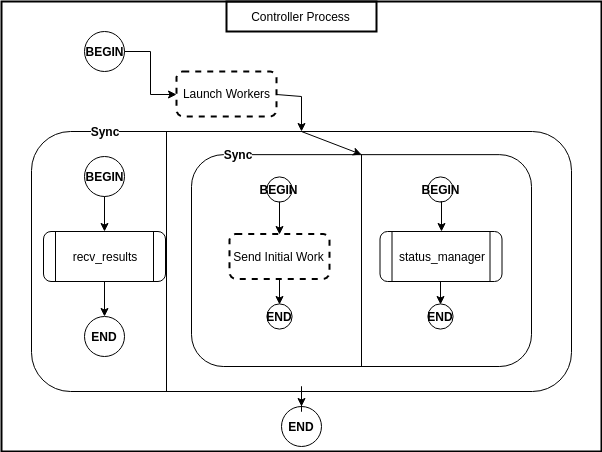

# LoadBalancers.jl
Package containing dynamic load balancing strategies in Julia.

```julia driver.jl``` 

## Load Balancing Algorithms

### Random Polling (RP)
- **Controller**: 
  - Distributes work
  - handles results/completed work, and 
  - receives status update messages from workers
- **Workers**: 
  - Do work
  - Whenever work runs out, request work from a random worker
  - Send status and results messages to controller

### Scheduler Based (SB)
- **Controller**: Acts as a scheduler.
  - Keep a list of idle and active workers
  - Receive status updates from workers
  - Match idle workers with active workers
- **Worker**: 
  - Send messages to and from controller
  - Request work from other worker
  - Do work
  - Send work to a requesting worker

#### Design Details
Legend:
- Rounded rectangles indicate synchronized blocks
- Dotted rounded rectangles indicate remote processes (launched via `@spawnat`)
- Rectangles with two verticle lines on the edges indicate a separate task launched on the same process

**Controller (SB)**


